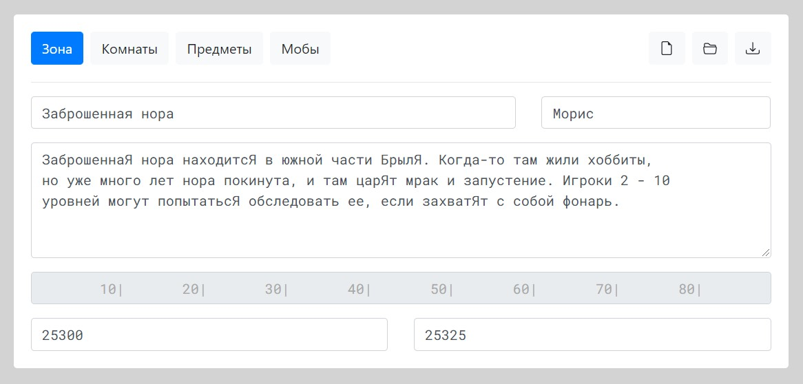
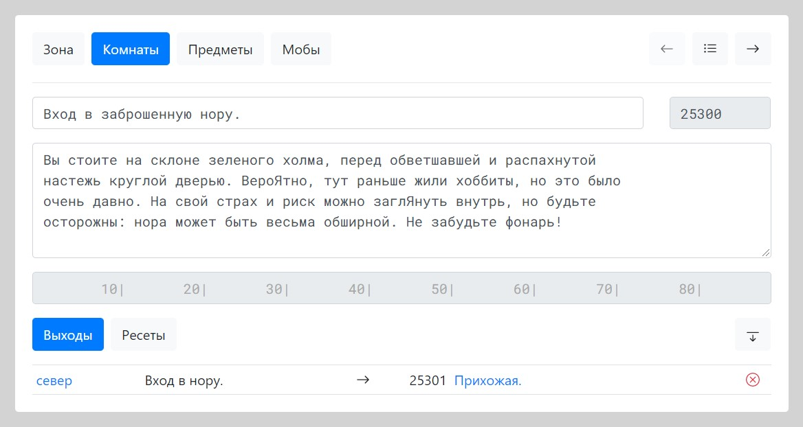
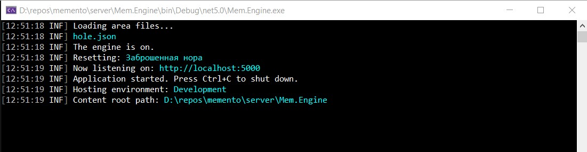
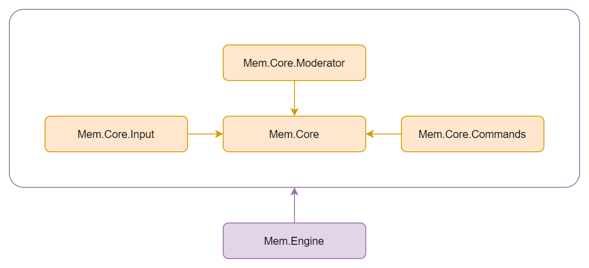
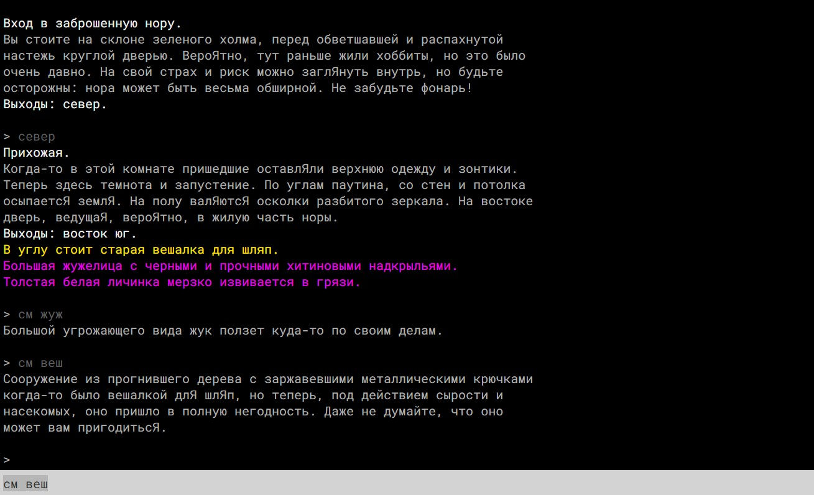
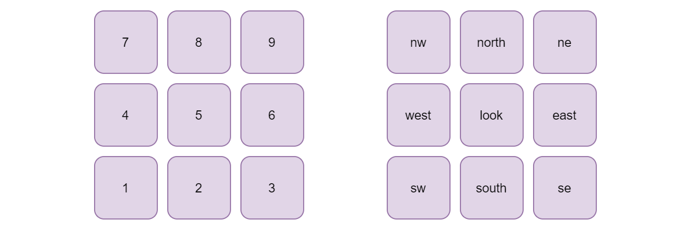

# Memento

A full-fledged MUD system: a server, a client and an area editor.

## Technologies

ASP.NET Core, SignalR, Serilog, Angular, Bootstrap, C#, TypeScript, JavaScript.

## The context

In general a [MUD](https://en.wikipedia.org/wiki/MUD) (multi-user dungeon/dimension/domain) is a text based multiplayer real-time online game.

There are three major entities MUD games usually consist of.

* __Rooms__, the fundamental units of space the game takes place in.

* __Items__, passive objects without behavior, but with a certain meaning and value.

* __Mobiles__, active subjects that can move around, manage items and interact with each others.

Usually rooms, items and mobiles are grouped in areas thus forming a MUD world.

To explore the world, players create characters that are in fact just plain mobiles, and manipulate them using commands.

## The system

A complete MUD system consists of three vital parts.

* A __server__, which actually runs the game and manages client connections.

* A __client__, mainly a console that takes a user's input (commands) and provides the server's output (plain text, describing the current game state to a particular player).

* A certain form of an __area editor__ to create and edit the game world.

## The project

This project is an implementation of the full MUD system at its very base level, without any particular game design.

* The Angular implemented browser area editor provides a convenient way to create and edit MUD areas.

* The ASP.NET Core server can read these areas, build a world upon them, run it, manage multiple real-time client connections using SignalR, register new playing characters and process several basic commands.

* The JavaScript implemented browser client is very simple, but provides an easy way to test the game process.

Primarily the project is aiming russian MUD community, but with a bit of work can be internationalized if necessary.

## The value

Basically this project has been developed for the purpose of learning .NET and Angular technologies. It may not be a best solution to build a mature MUD system upon yet. In fact I have intentions to completely rewrite the editor, the client, and maybe even the server itself if I deside to try another programming language. But still this project is a very good starting point, and it certainly demonstrates some useful ideas for productive MUD development, so feel free to borrow them and use in your own projects.

## The area editor

Each area is described in a single JSON file. The area editor is a tool to produce and edit such files.

You can create a new area file, load an existing file for further editing, and save the information being edited into a file on your drive.

For the time being the editor project is in development state, so to run it you should have npm package manager and Angular CLI installed on your machine. Navigate to the `client` folder and run the command `ng serve --open`.

The folder name `client` may seem a bit misleading. The intention was to eventually make the area editor an integral part of a whole MUD website, so the current simple JavaScript client served by the engine is a temporary solution.

In the editor you can describe the area, create and describe rooms, items and mobiles.

To connect rooms with each other use the exit section of the room editor.

To put the created items and mobiles inside a room use the reset section of the room editor.

## The server

The server must have at least one valid area file to build and run the world.

It can manage multiple connections at once, so multiple users can explore the world simultaneously, and interact with each other.

For now it supports the following commands.

* `смотреть` (look around, or at something/someone/direction)
* `выходы` (examine a current room's exits all at once)
* `инвентарь` (examine the character's inventory)
* `взять` (take an item into the inventory)
* `бросить` (drop an inventory item on the floor)
* `конец` (quit the game, disconnect)
* `север` (go north)
* `восток` (go east)
* `юг` (go south)
* `запад` (go west)
* `вверх` (go up)
* `вниз` (go down)
* `войти` (enter somewhere)
* `северо-восток`, `св` (go north-east)
* `юго-восток`, `юв` (go south-east)
* `юго-запад`, `юз` (go south-west)
* `северо-запад`, `сз` (go north-west)

Commands and arguments may be entered partially, like `см` instead of `смотреть`, or `см кры` instead of `смотреть крыса`.

If there are several entities with a same keyword, each entity can be picked using a number. Suppose there are two rats in a room.

`Тощая крыса вылизывает свои голые лапки.`

`Огромная толстая крыса сверкает глазами из темного угла.`

They both are rats, so to look at one and then at another the following commands may be used.

`смотреть крыса`

`смотреть 2 крыса`

Command arguments can be provided in the loose or the strict mode. The first one interprets each word after the command itself as a separate argument. The second one interprets several words as a single argument if they are enclosed in a pair of double quotes. Consider the following.

The input `смотреть крыса` can pick any mobile with the keyword `крыса`.

The input `смотреть "толстая крыса"` picks the mobile if its full name is exactly `толстая крыса`.

The server solution has the following architecture.

`Mem.Core` project contains the fundamental entities and the interfaces to manage them. Other projects just implement the interfaces, so they can easily be switched to other implementations.

`Mem.Engine` project is the web host and the composition root of the whole application.

## The client

The client is very simple, and for now its sole purpose is the rapid testing of the game process.

It connects to the server right after a user clicks the play button, and then the interaction begins.

For the convenience the movement commands can be sent using the num pad.

## Summary

There is a lot of features to be implemented yet, but the foundation is quite rich already, so let's build some worlds!

## Thanks

To [Arda MUD](http://arda.pp.ru/) for the inspiration.

To Moris for the [free area sample](http://arda.pp.ru/build/hole.are).
